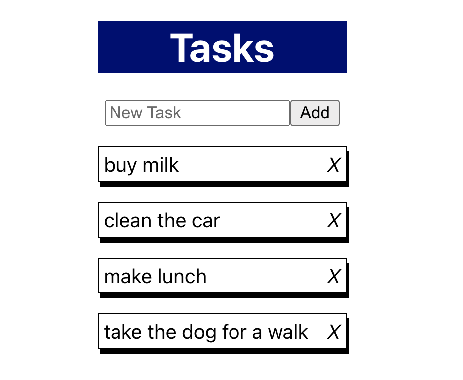

# React Todo List

Basic Todo App built with React to practice developing with:

* Functional Components
* State Hooks
* Event Listeners
* Spread syntax for dynamic data



## Quick Start
### Install Dependencies

```
npm install
```
### Run
```
npm start
```
### Author

Andrew Stratton

### Version

1.0.0


